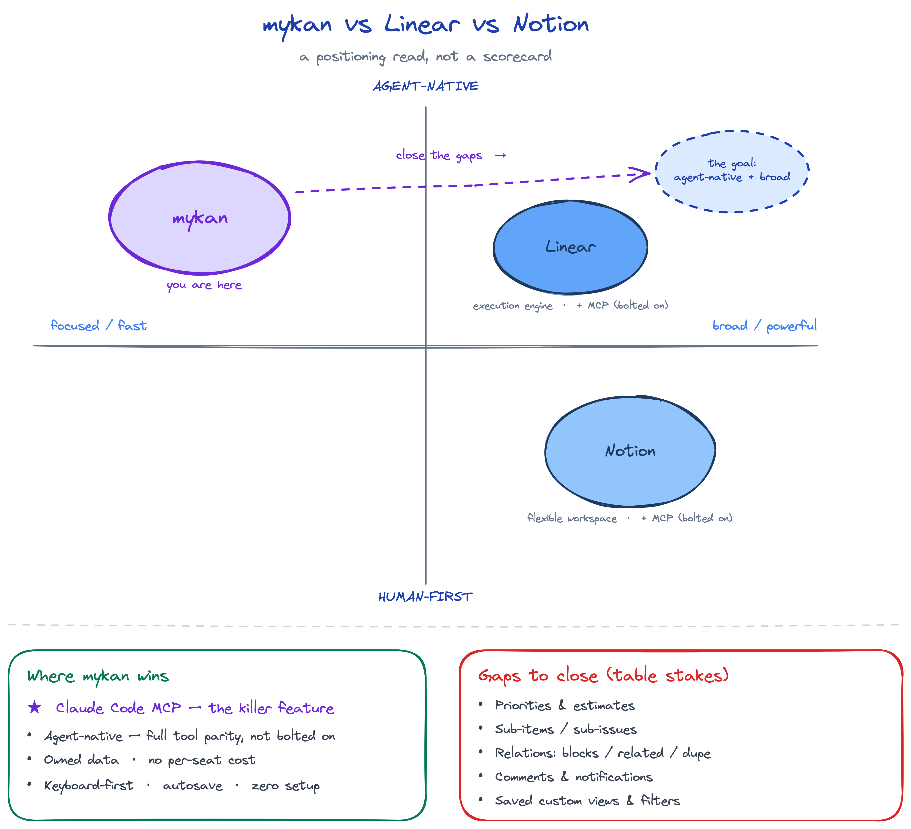

# Competitive analysis: mykan vs. Linear vs. Notion

_Last updated: 2026-07-12_

An honest read of where mykan stands against the two products it most resembles.
**Linear** (issue tracking / engineering execution) and **Notion** (flexible
databases + docs) are both mature, well-funded team products. mykan is a small,
fast, owned, agent-native tracker. This doc is a positioning read, not a
scorecard — mykan wins on being tight, automatable, and self-owned; it loses on
breadth, collaboration, and analytics.

## Positioning

The map's argument: mykan sits alone in the **agent-native + focused** quadrant.
Linear and Notion are broader and more powerful, but both are human-first with
MCP support bolted on after the fact. The strategic move is to travel _right_
(add breadth) without giving up the agent-native, keyboard-first character that
is mykan's moat.

### The moat is the Claude Code MCP

The single most valuable, most differentiated thing about mykan is that you can
**operate the entire app from Claude Code (or any MCP client) as a first-class
surface** — nine tools with full parity to the UI, designed agent-first rather
than retrofitted. That's the outstanding feature and the thing worth protecting
and deepening. The Telegram bot is a real but _minor_ convenience by comparison —
a lightweight capture front door, not a differentiator — and should not be
mistaken for the moat.

## Master feature table

✅ = has it · ⚠️ = partial / basic · ❌ = doesn't have it

| Feature | Linear | Notion | mykan |
|---|:---:|:---:|:---:|
| **Core tracking** | | | |
| Kanban board | ✅ | ✅ | ✅ |
| List view | ✅ | ✅ | ✅ |
| Statuses / workflow columns | ✅ | ✅ | ✅ (5: todo→in-progress→blocked→testing→done) |
| Item types (feature/bug/task/idea) | ⚠️ (via labels) | ⚠️ (via property) | ✅ (first-class) |
| Priorities | ✅ | ⚠️ (property) | ❌ |
| Estimates / story points | ✅ | ⚠️ (property) | ❌ |
| Due dates / scheduling | ✅ | ✅ | ❌ |
| Assignees | ✅ | ✅ | ✅ |
| Tags / labels | ✅ | ✅ | ✅ (inline, keyboard-first) |
| Areas / grouping tree | ⚠️ (teams/projects) | ✅ (nested pages) | ✅ (category tree) |
| Sub-items / sub-issues | ✅ | ✅ | ❌ |
| Item relations (blocks/dupe/related) | ✅ | ⚠️ (relations) | ❌ |
| Global ordering / manual rank | ✅ | ✅ | ✅ (per-project float position) |
| **Planning** | | | |
| Cycles / sprints | ✅ | ⚠️ (manual) | ❌ |
| Projects / milestones | ✅ | ✅ | ⚠️ (projects, no milestones) |
| Roadmaps / initiatives | ✅ | ⚠️ (timeline) | ❌ |
| Timeline / Gantt | ⚠️ | ✅ | ❌ |
| Calendar view | ❌ | ✅ | ❌ |
| Triage inbox | ✅ | ❌ | ❌ |
| **Content** | | | |
| Rich-text body | ⚠️ (markdown) | ✅ (blocks) | ✅ (Tiptap, JSONB) |
| Inline images | ✅ | ✅ | ✅ |
| File attachments | ✅ | ✅ | ✅ (signed direct upload) |
| Docs / wiki | ⚠️ (Linear Docs) | ✅ (the whole point) | ❌ |
| Custom fields / properties | ⚠️ (limited) | ✅ (many types + formulas/rollups) | ❌ |
| Item history / versions | ✅ | ✅ (paid) | ✅ (save-granularity) |
| **Collaboration** | | | |
| Comments / @mentions | ✅ | ✅ | ❌ |
| Real-time multiplayer editing | ✅ | ✅ | ❌ (single write at a time) |
| Notifications | ✅ | ✅ | ❌ |
| Granular sharing / permissions | ✅ | ✅ | ⚠️ (named sharing per project) |
| Public share links | ✅ | ✅ | ❌ |
| **Platform & automation** | | | |
| Keyboard-first / command palette | ✅ (best-in-class) | ⚠️ | ✅ (vim nav j/k/g/G/u/d, Ctrl-f/b) |
| Light / dark theme | ✅ | ✅ | ✅ (token-based) |
| REST/GraphQL API + webhooks | ✅ | ✅ | ⚠️ (REST, no public webhooks) |
| **Native MCP / agent-native** | ⚠️ (MCP server added) | ⚠️ (MCP server added) | ✅ (built agent-first, 9 tools, full parity) |
| Telegram bot | ❌ | ❌ | ✅ |
| GitHub/Slack/git-branch integration | ✅ | ⚠️ | ❌ |
| Templates | ✅ | ✅ | ❌ |
| Import/export | ✅ | ✅ | ❌ |
| Analytics / insights | ✅ | ⚠️ | ❌ |
| Mobile apps | ✅ (native) | ✅ (native) | ⚠️ (responsive web) |
| Self-hosted / owned data | ❌ | ❌ | ✅ |
| Per-seat cost | ✅ ($) | ✅ ($) | ✅ Free |

## Linear

**Where Linear beats mykan** — cycles/sprints, priorities, estimates, sub-issues
and issue relations (blocks/duplicate), a triage inbox, roadmaps/initiatives,
deep git integration (branch names, PR linking, auto-status on merge),
Slack/GitHub, saved custom views & filters, notifications, analytics, native
mobile apps, and a command palette. It's a team execution tool; mykan is a
personal / small-team tracker.

**Where mykan beats Linear** — the **Claude Code MCP** is the standout: mykan is
**agent-native by construction** (an agent can do anything a user can, full tool
parity, not bolted on), so you can drive the whole tracker from your coding agent.
The data is **yours** (self-hosted Supabase, no per-seat pricing), and the
interaction model is more radically minimal — inline-everything, implicit
autosave, Esc/click-off dismiss, no modal ceremony. (A Telegram bot exists for
quick capture, but it's a minor convenience, not the differentiator.) Linear is
fast; mykan is _smaller_, with essentially zero learning curve.

## Notion

**Where Notion beats mykan** — it's a database engine: many views
(table/board/calendar/timeline/gallery), arbitrary custom properties, formulas,
relations & rollups, nested pages/wiki/docs, templates, comments/@mentions,
real-time multiplayer, public pages, granular permissions, forms, and a huge
integration ecosystem. Anything mykan models with fixed columns, Notion models
with configurable properties.

**Where mykan beats Notion** — the **Claude Code MCP**, again: you operate mykan
from your agent as a first-class surface, where Notion's MCP is a later add-on to
a human-first canvas. Plus **speed and focus** — mykan is a purpose-built tracker,
not a blank canvas you have to assemble, so there's no setup tax and no lag. It's
**keyboard-first with vim navigation** (Notion is mouse-centric). History is
**save-granular** (each save seals a version — a cleaner mental model than
Notion's timestamped page history, which is also paywalled). And the data is
self-hosted and free.

## Bottom line

- **Linear** is the better _engineering execution_ tool (sprints, roadmaps, git,
  priorities, analytics).
- **Notion** is the better _flexible workspace_ (databases, docs, custom fields,
  collaboration).
- **mykan** wins on the **Claude Code MCP** (its killer feature), plus
  keyboard minimalism, owned data, and radical focus — it's the tightest, fastest,
  most automatable option for one person or a tiny trusted group, and the only one
  where an AI agent is a genuine first-class user rather than an afterthought.

The clearest gaps worth closing — the "travel right on the map" work — are
**priorities/estimates**, **sub-items**, **item relations (blocks/related)**,
**comments/notifications**, and **saved custom views/filters**. Those are table
stakes both rivals have and mykan doesn't.
